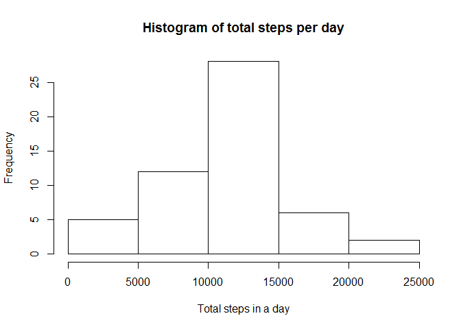
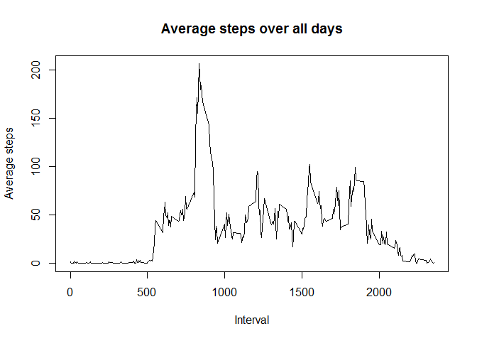
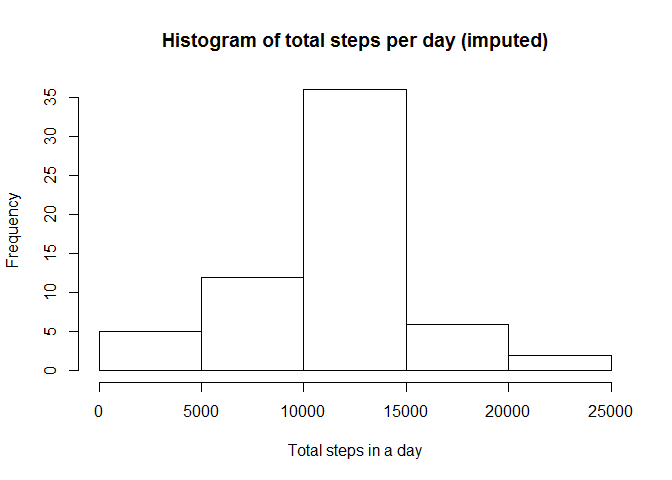
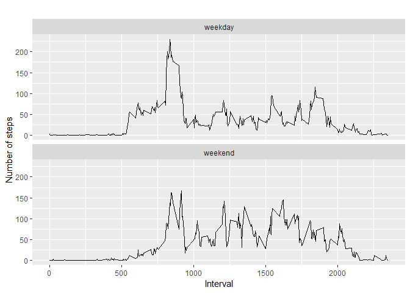

In this assignment we'll make use of data from a personal activity
monitoring device. This device collects data at 5 minute intervals
through out the day. The data consists of two months of data from an
anonymous individual collected during the months of October and
November, 2012 and include the number of steps taken in 5 minute
intervals each day.

Before we begin the step-by-step process, we'll load the necessary
libraries for the rest of the steps in process:

    library(data.table)
    library(ggplot2)
    library(dplyr)

    ## 
    ## Attaching package: 'dplyr'

    ## The following objects are masked from 'package:data.table':
    ## 
    ##     between, first, last

    ## The following objects are masked from 'package:stats':
    ## 
    ##     filter, lag

    ## The following objects are masked from 'package:base':
    ## 
    ##     intersect, setdiff, setequal, union

1. Loading and preprocessing the data
-------------------------------------

#### 1.1. Load the data (i.e. read.csv())

First we'll unzip the file:

    if(!file.exists("./activity.csv"))
        unzip("./activity.zip")

Once the CSV file is available, then we'll read the file in data frame:

    if(file.exists("./activity.csv"))
        activity = read.csv("activity.csv", header = T)

#### 1.2. Process/transform the data (if necessary) into a format suitable for your analysis

    activity$date <- as.Date(as.character(activity$date))

2. What is mean total number of steps taken per day?
----------------------------------------------------

#### 2.1. Calculate the total number of steps taken per day

This can be achieved by a) grouping the steps by date, and taking the
sum of steps per day.

    activity_by_day = group_by(activity, date) %>%
            summarise(total = sum(steps))

#### 2.2. Make a histogram of the total number of steps taken each day

    hist(activity_by_day$total, main="Histogram of total steps per day", xlab="Total steps in a day")

#### 2.3 Calculate and report the mean and median of the total number of steps taken per day

    mysummary = summary(activity_by_day)
    print(mysummary)

    ##       date                total      
    ##  Min.   :2012-10-01   Min.   :   41  
    ##  1st Qu.:2012-10-16   1st Qu.: 8841  
    ##  Median :2012-10-31   Median :10765  
    ##  Mean   :2012-10-31   Mean   :10766  
    ##  3rd Qu.:2012-11-15   3rd Qu.:13294  
    ##  Max.   :2012-11-30   Max.   :21194  
    ##                       NA's   :8

The summary of Activity by Day shows that the **Median :10765 ** and
**Mean :10766 **

3. What is the average daily activity pattern?
----------------------------------------------

#### 3.1 Make a time series plot (i.e. type="l") of the 5-minute interval (x-axis) and the average number of steps taken, averaged across all days (y-axis)

    steps_by_interval <- aggregate(steps ~ interval, activity, mean)
        
    # create a time series plot 
    plot(steps_by_interval$interval, steps_by_interval$steps, type='l', 
             main="Average steps over all days", xlab="Interval", 
             ylab="Average steps")

#### 3.2 Which 5-minute interval, on average across all the days in the dataset, contains the maximum number of steps?

    max_steps_row <- which.max(steps_by_interval$steps)
        
    # find interval with this max
    steps_by_interval[max_steps_row, ]

    ##     interval    steps
    ## 104      835 206.1698

The Max Steps by Interval calculation shows that the interval **835**
had the maximum of **206.1698113** steps.

4. Imputing missing values
--------------------------

#### 4.1. Calculate and report the total number of missing values in the dataset (i.e. the total number of rows with NAs)

    total_missing_values = sum(is.na(activity$steps))

Total number of missing values is **2304**

#### 4.2. Devise a strategy for filling in all of the missing values in the dataset. The strategy does not need to be sophisticated. For example, you could use the mean/median for that day, or the mean for that 5-minute interval, etc.

The strategy, as suggested by the instructor, is to replace missing
values with the mean of 5 minute interval

    data_imputed <- activity
    for (i in 1:nrow(data_imputed)) {
      if (is.na(data_imputed$steps[i])) {
        interval_value <- data_imputed$interval[i]
        steps_value <- steps_by_interval[
          steps_by_interval$interval == interval_value,]
        data_imputed$steps[i] <- steps_value$steps
      }
    }

#### 4.3. Create a new dataset that is equal to the original dataset but with the missing data filled in.

    df_imputed_steps_by_day <- aggregate(steps ~ date, data_imputed, sum)
    print(head(df_imputed_steps_by_day))

    ##         date    steps
    ## 1 2012-10-01 10766.19
    ## 2 2012-10-02   126.00
    ## 3 2012-10-03 11352.00
    ## 4 2012-10-04 12116.00
    ## 5 2012-10-05 13294.00
    ## 6 2012-10-06 15420.00

#### 4.4. Make a histogram of the total number of steps taken each day and Calculate and report the mean and median total number of steps taken per day. Do these values differ from the estimates from the first part of the assignment? What is the impact of imputing missing data on the estimates of the total daily number of steps?

    hist(df_imputed_steps_by_day$steps, main="Histogram of total steps per day (imputed)", xlab="Total steps in a day")

The summary of Imputed Activity by Day shows that the Mean:
**1.076618910^{4}** and Median: **1.076618910^{4}**

#### The mean and median did not change after imputation.

5. Are there differences in activity patterns between weekdays and weekends?
----------------------------------------------------------------------------

#### 5.1. Create a new factor variable in the dataset with two levels - "weekday" and "weekend" indicating whether a given date is a weekday or weekend day.

    data_imputed['type_of_day'] <- weekdays(as.Date(data_imputed$date))
    data_imputed$type_of_day[data_imputed$type_of_day  %in% c('Saturday','Sunday') ] <- "weekend"
    data_imputed$type_of_day[data_imputed$type_of_day != "weekend"] <- "weekday"    
        
    data_imputed$type_of_day <- as.factor(data_imputed$type_of_day)
        
    # calculate average steps by interval across all days
    df_imputed_steps_by_interval <- aggregate(steps ~ interval + type_of_day, data_imputed, mean)

#### 5.2. Make a panel plot containing a time series plot (i.e. type="l") of the 5-minute interval (x-axis) and the average number of steps taken, averaged across all weekday days or weekend days (y-axis).

    # creat a plot
    qplot(interval, 
          steps, 
          data = df_imputed_steps_by_interval, 
          type = 'l', 
          geom=c("line"),
          xlab = "Interval", 
          ylab = "Number of steps", 
          main = "") +
      facet_wrap(~ type_of_day, ncol = 1)

    ## Warning: Ignoring unknown parameters: type

